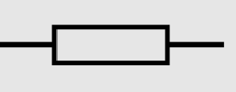
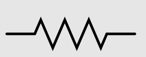
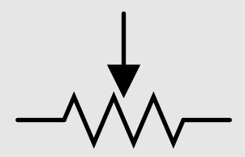
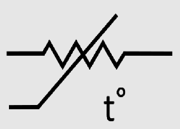
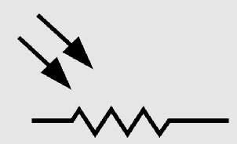
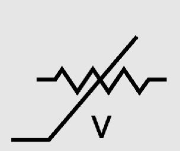
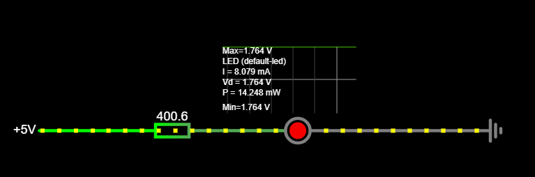
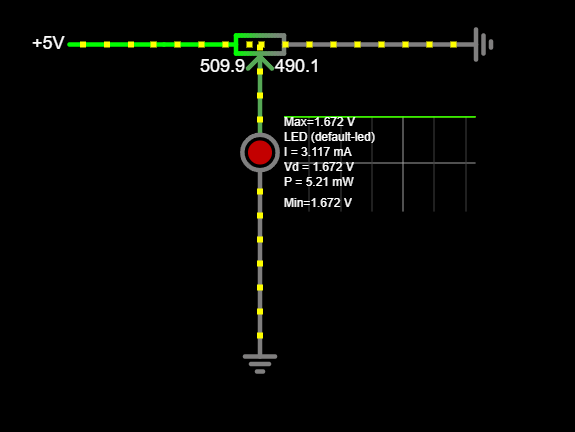
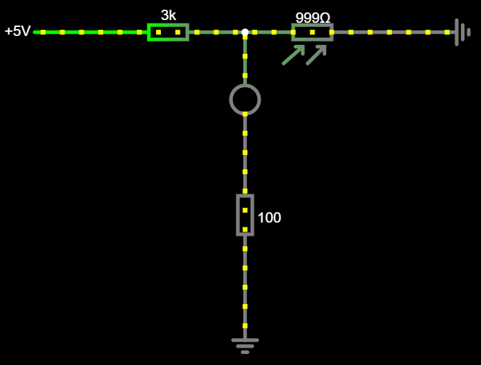

# Takistid
Takisti on elektroonika baaselement, mis piirab elektrivoolu ja alandab pinget elektriahelates. See koosneb tavaliselt takistusmaterjalist, mis muundab elektrienergia soojusenergiaks, vähendades voolu tugevust vastavalt Ohmi seadusele $(V = IR)$. Takisti väärtust mõõdetakse oomides ($\Omega$) ja see võib olla kas fikseeritud või muutuv (nt potentsiomeeter). Takistid on valmistatud erinevatest materjalidest, nagu süsinik, metalloksiidid ja traadikeerdtakistid, ning neid valitakse sõltuvalt soovitud elektrilistest omadustest ja kasutusotstarbest.

Takisteid kasutatakse laialdaselt erinevates elektroonikaseadmetes, et juhtida vooluringi tööd ja kaitsta komponente liigse voolu eest. Neid rakendatakse pingejagurites, signaali reguleerimiseks, voolutugevuse piiramiseks LED-ide ja transistoride korral ning osana filtritest ja võnkeringidest. Samuti mängivad takistid rolli soojusandurites ja takistuse mõõtmises. Takistid elektroonika põhikomponent, millel on oluline roll peaaegu igas elektriahelas.

## Takisti olulisemad omadused

**Nimitakistus *(ingl Resistance, R)*** - Takistuse suurus oomides ($\Omega$),  määrab, kui palju takisti piirab voolu vastavalt Ohmi seadusele.

**Tolerants (ingl Tolerance, $\pm$%)** – Näitab, kui palju võib tegelik takistus erineda nimitakistusest. Tüüpilised väärtused on $\pm1\%$, $\pm 5\%$ või $\pm 10\% $.

**Nimivõimsus *(ingl Power Rating, W)*** – Määrab maksimaalse võimsuse, mida takisti suudab hajutada ilma ülekuumenemata. Tavaliselt jääb vahemikku 0,125 W kuni 5 W.

**Piirpinge *(Maximum Working Voltage, V)*** – Suurim voolupinge, mida takisti võib ohutult taluda.

## Levinud takistite liigid ja sümbolid

**Püsitakisti *(ingl Fixed Resistor)*** - Nende takistite takistus ei muutu normaalse kasutuse käigus.

* Püsitakisti sümbol IEC standardi järgi:

    
* Püsitakisti sümbol ANSI standardi järgi:

    

**Potentsiomeeter *(ingl Potentiometer)*** - Kindlas vahemikus muutuva takistusega takisti, mille takistus sõltub füüsiliselt keeratava regulaatori asendist.

* Potentsiomeetri sümbol:
    
    

**Termistor *(ingl Thermistor)*** - Kindlas vahemikus muutuva takistusega takisti, mille takistus sõltub tema temperatuurist.

* Termistori sümbol:

        

**Fototakisti *(ingl Light Dependent Resistor, Fotoresistor)*** - Kindlas vahemikus muutuva takistusega takisti, mille takistus sõltub sellele langeva valguse intensiivsusest.

* Fototakisti sümbol:

    

**Varistor *(ingl Voltage Dependent Resistor)*** - Kindlas vahemikus muutuva takistusega takisti, mille takistus sõltub sellele mõjuvast voolupingest.

* Varistori sümbol:

    

## Näiteid takistite kasutamisest

* Takisti piirab LED-i läbivat voolu ja ei lase sel läbi põleda. NB! muuda parempoolsel paneelil takisti väärtust ja märka kuidas muutub LED-i läbiv voolutugevus.

    

    [Interaktiivne simulatsioon](https://www.falstad.com/circuit/circuitjs.html?ctz=CQAgjCAMB0l3BWcMBMcUHYMGZIA4UA2ATmIxAUgpABZsKBTAWjDACgAlKEFPPEJniq9+VKjSpIxUaAjYAnbiPC8efbhJiE2YQihX9lKCWsMgAJgwBmAQwCuAGwAuTBw3PhuY2OwDmPE2VsQkN1MTYJelZ9NENAjH1hAH1CGiTIJIAPMEhsXGwksGgMQmwMHIQUXFy8YkIMdNh8SAw8QkgEVuw8MBoEBDwkliSUEaTsNm7PADEIKggcuAEIABUbAGsASwBnJztttiA)

* Potentsiomeetri nupu asendiga saab reguleerida LED-i läbiva voolu hulka.

    
    
    [Interaktiivne simulatsioon](https://www.falstad.com/circuit/circuitjs.html?ctz=CQAgjCAMB0l3BWcMBMcUHYMGZIA4UA2ATmIxAUgpABZsKBTAWjDACgAlcMFENPWgP5QRNKkiqToCNmEK8UKGnzF8lIbAgUgAJgwBmAQwCuAGwAuTUwx3gRUyOwDma5ZoXqac+2xfZshHz4tHBBApKyGMqsCsH+gUpUEGDwUNA0xI7w2TnKHAwAzgCWBeaGAHYAxgxsYvSJfBi8AQLxImAA+oQ0HZAdAB4p-pDYHWDQhASQKNhikF64eAG9sCM0GDyETTjEJFEYHSwdKGMd2GxAA)

* Fototakisti reguleerib LED-i tööd - LED on kustus kui fototakistile langev valgus on suure intensiivsusega.

    
    
    [Interaktiivne simulatsioon](https://www.falstad.com/circuit/circuitjs.html?ctz=CQAgjCAMB0l3BWcMBMcUHYMGZIA4UA2ATmIxAUgpABZsKBTAWjDACgAlcMFENPWgP5QRNKkiqToCNgCduvYSjF98I3HDbYMNPiuHYEitVNKQw8S5YgAZAJYBzABYAXADoBnAEKzHrgHYMHh5sYISK+mrKVNhofCAAJgwAZgCGAK4ANi5MmQwJ4CJS5nJ6MXHRtHAiFpBsDmVVVJU0hLqS9SCGxgI0YaoCHUA)