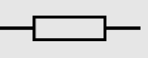
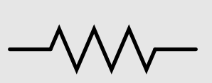
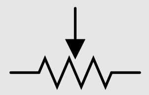
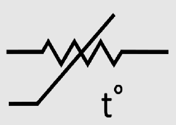
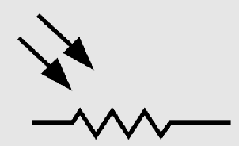
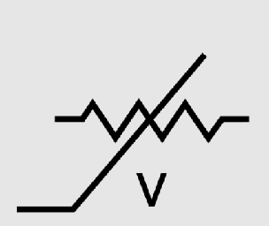
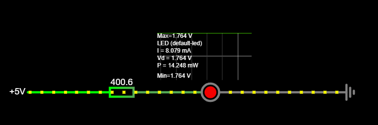
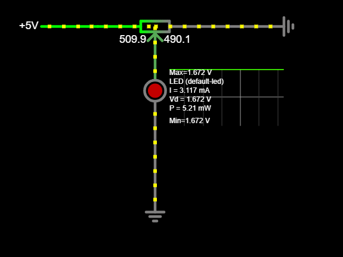
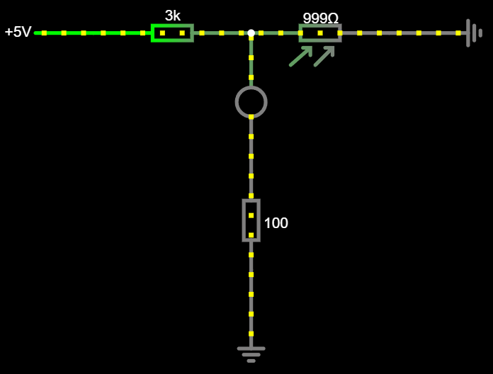

# Takistid
Takisti on elektroonika baaselement, mis takistab elektrivoolu liikumist. Voolu läbimisel tekib takistil pingelang ja osa elektrienergiast muundub soojuseks. Pinge, voolutugevuse ja takistuse omavahelist seost kirjeldab [Ohmi seadus](https://github.com/nullyks/Arduino-fyysika-p6hiteadmised/blob/main/materjalid/1_Ohmi_seadus.md) $(U = I \cdot R)$. Takisti väärtust mõõdetakse oomides ($\Omega$) ja see võib olla kas fikseeritud või muutuv (nt potentsiomeeter). Takisteid valmistatakse näiteks süsinikust, metallkilest, metalloksiidist või takistustraadist. Sobiv takistitüüp valitakse vajalike elektriliste omaduste ja kasutusotstarbe järgi.

Takisteid kasutatakse, et juhtida [vooluahela](https://github.com/nullyks/Arduino-fyysika-p6hiteadmised/blob/main/materjalid/3_vooluahelad.md) tööd ja kaitsta komponente liigse voolu eest. Neid rakendatakse pingejagurites, signaali reguleerimiseks, voolutugevuse piiramiseks [LED-ide](2_dioodid.md) ja [transistorite](3_transistorid.md) korral ning osana filtritest ja võnkeringidest. Samuti kasutatakse takisteid termistoridel põhinevates temperatuuriandurites ja takistuse mõõtmisel. Takistid on elektroonika põhikomponendid, millel on oluline roll peaaegu igas elektriahelas.

## Takisti olulisemad omadused

**Nimitakistus *(ingl Resistance, R)*** – Takisti takistuse nimiväärtus oomides ($\Omega$), mis määrab [Ohmi seaduse](https://github.com/nullyks/Arduino-fyysika-p6hiteadmised/blob/main/materjalid/1_Ohmi_seadus.md) järgi pinge ja voolutugevuse suhte.

**Tolerants (ingl Tolerance, $\pm$%)** – Näitab, kui palju võib tegelik takistus erineda nimitakistusest. Tüüpilised väärtused on $\pm1\%$, $\pm 5\%$ või $\pm 10\% $.

**Nimivõimsus** *(ingl power rating, W)* – suurim võimsus, mida takisti võib ettenähtud töötingimustes hajutada. Takistis hajuv võimsus leitakse valemiga $P = U \cdot I = I^2R = U^2/R$. Valida tuleb arvutuslikust hajuvõimsusest suurema nimivõimsusega takisti.

**Piirpinge** *(ingl maximum working voltage, V)* – suurim pinge, mida takisti võib ettenähtud tingimustes ohutult taluda. Piirpinge ületamine võib takistit kahjustada ka juhul, kui selle nimivõimsust ei ületata.

## Levinud takistite liigid ja sümbolid

**Püsitakisti *(ingl Fixed Resistor)*** - Nende takistite takistus ei muutu normaalse kasutuse käigus.

* Püsitakisti sümbol IEC standardi järgi:

    
* Püsitakisti sümbol ANSI standardi järgi:

    

**Potentsiomeeter** *(ingl potentiometer)* – kolme viiguga reguleeritav takisti. Kaks äärmist viiku on ühendatud takistuskihi otstega ja keskmine viik liugkontaktiga. Kõiki kolme viiku kasutades toimib potentsiomeeter pingejagurina, mille väljundpinge sõltub regulaatori asendist.

* Potentsiomeetri sümbol:
    
    

**Termistor *(ingl thermistor)*** – temperatuuritundlik takisti, mille takistus muutub temperatuuri muutudes. NTC-termistori takistus temperatuuri tõustes väheneb, PTC-termistori takistus suureneb.

* Termistori sümbol:

        

**Fototakisti** *(ingl light-dependent resistor, LDR; photoresistor)* – valgustundlik takisti, mille takistus valgustatuse suurenedes tavaliselt väheneb.

* Fototakisti sümbol:

    

**Varistor** *(ingl voltage-dependent resistor, VDR)* – mittelineaarne pingetundlik takisti, mille takistus langeb järsult, kui pinge ületab kindla taseme. Varistore kasutatakse peamiselt lühiajaliste liigpingeimpulsside piiramiseks ja vooluahelate kaitsmiseks.

* Varistori sümbol:

    

## Näiteid takistite kasutamisest

* Takisti piirab LED-i läbivat voolu ja kaitseb seda liigvoolu eest. Muuda simulatsiooni parempoolsel paneelil takisti väärtust ning jälgi, kuidas muutub LED-i läbiv voolutugevus.

    

    [Interaktiivne simulatsioon](https://www.falstad.com/circuit/circuitjs.html?ctz=CQAgjCAMB0l3BWcMBMcUHYMGZIA4UA2ATmIxAUgpABZsKBTAWjDACgAlKEFPPEJniq9+VKjSpIxUaAjYAnbiPC8efbhJiE2YQihX9lKCWsMgAJgwBmAQwCuAGwAuTBw3PhuY2OwDmPE2VsQkN1MTYJelZ9NENAjH1hAH1CGiTIJIAPMEhsXGwksGgMQmwMHIQUXFy8YkIMdNh8SAw8QkgEVuw8MBoEBDwkliSUEaTsNm7PADEIKggcuAEIABUbAGsASwBnJztttiA)

* Potentsiomeetri nupu asendiga saab reguleerida LED-i läbiva voolu tugevust.

    **Märkus.** Näide on lihtsustatud demonstratsioon, mitte päris elektriskeem.

    
    
    [Interaktiivne simulatsioon](https://www.falstad.com/circuit/circuitjs.html?ctz=CQAgjCAMB0l3BWcMBMcUHYMGZIA4UA2ATmIxAUgpABZsKBTAWjDACgAlcMFENPWgP5QRNKkiqToCNmEK8UKGnzF8lIbAgUgAJgwBmAQwCuAGwAuTUwx3gRUyOwDma5ZoXqac+2xfZshHz4tHBBApKyGMqsCsH+gUpUEGDwUNA0xI7w2TnKHAwAzgCWBeaGAHYAxgxsYvSJfBi8AQLxImAA+oQ0HZAdAB4p-pDYHWDQhASQKNhikF64eAG9sCM0GDyETTjEJFEYHSwdKGMd2GxAA)

* Fototakisti juhib LED-i tööd: valgustatuse suurenedes fototakisti takistus väheneb ja LED kustub. Muuda simulatsioonis fototakistile langeva valguse tugevust ning jälgi LED-i olekut.

    
    
    [Interaktiivne simulatsioon](https://www.falstad.com/circuit/circuitjs.html?ctz=CQAgjCAMB0l3BWcMBMcUHYMGZIA4UA2ATmIxAUgpABZsKBTAWjDACgAlcMFENPWgP5QRNKkiqToCNgCduvYSjF98I3HDbYMNPiuHYEitVNKQw8S5YgAZAJYBzABYAXADoBnAEKzHrgHYMHh5sYISK+mrKVNhofCAAJgwAZgCGAK4ANi5MmQwJ4CJS5nJ6MXHRtHAiFpBsDmVVVJU0hLqS9SCGxgI0YaoCHUA)
