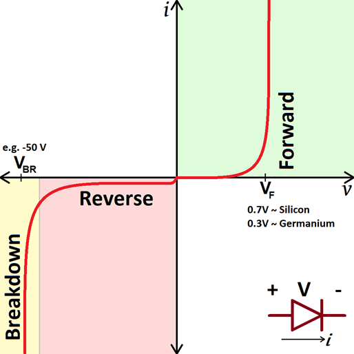
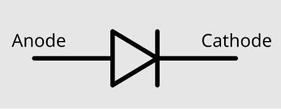
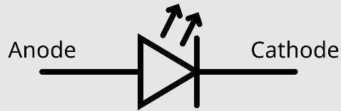
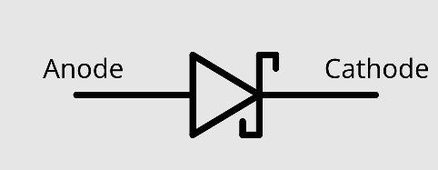
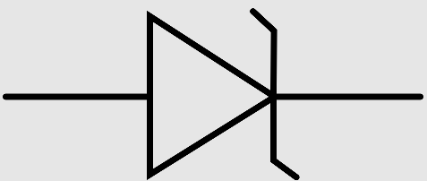
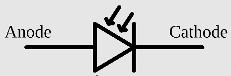
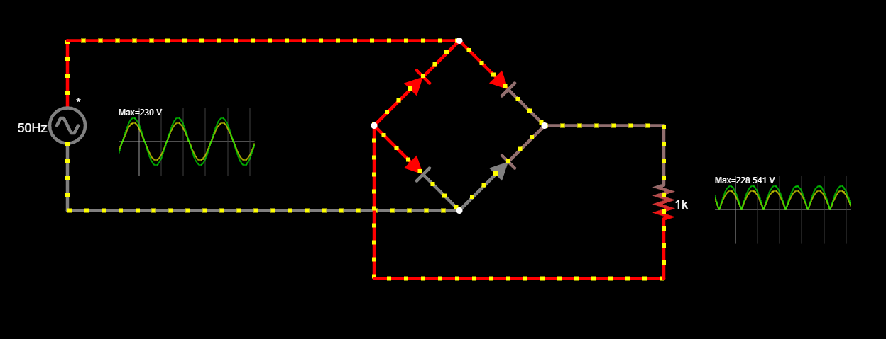
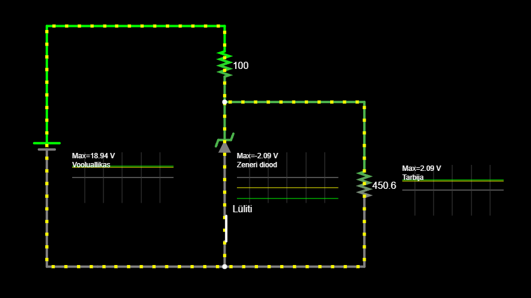

# Dioodid
Diood *(ingl Diode)* on elektrooniline baaselement, mis koosneb kahest pooljuhikihist – p-tüüpi ja n-tüüpi materjalist – moodustades PN-siirde. Selle põhifunktsioon on elektrivoolu juhtimine ühes suunas ja takistamine vastupidises suunas, toimides seega alalisvoolu suunajana. Kui dioodile rakendada ettepoole suunatud pinget (anood positiivne katoodi suhtes), siis vool pääseb läbi, samas kui vastupidise pinge korral takistab diood voolu liikumist, kuni teatud läviväärtuseni, mille ületamisel võib see kahjustuda.

Dioode kasutatakse laialdaselt erinevates elektroonilistes rakendustes, sealhulgas alaldi [vooluahelates](https://github.com/nullyks/Arduino_fyysika_p6hiteadmised/blob/main/materjalid/3_vooluahelad.md) vahelduvvoolu muundamiseks alalisvooluks, signaalide filtreerimiseks ja pinge stabiliseerimiseks. Spetsiifilised diooditüübid, nagu Zeneri dioodid, on mõeldud pingeregulatsiooniks, LED-dioodid valguse kiirgamiseks ja Schottky dioodid kiireks lülitamiseks ning madala pingelanguga rakendusteks. 

Dioodi tööd iseloomustab kõige paremini alljärgnev graafik, mis kujutab dioodile mõjuva voolupinge ja dioodi läbiva voolutugevuse suhet.

## Dioodi olulisemad omadused

**Lävipinge *(ingl Forward Voltage)*** –  pinge, mille juures diood hakkab juhtima voolu pärirežiimis (tüüpiliselt ränidioodidel ~0.7V, Schottky dioodidel ~0.2-0.4V).

**Pingelang *(ingl Voltage Drop)*** – pinge langus peale dioodi kui diood töötab maksimaalse lubatud voolutugevusega.

**Pärivool *(ingl Forward Current)***– maksimaalne lubatud pidev voolutugevus dioodi töötamise ajal pärirežiimis.

**Läbilöögipinge *(ingl Breakdown Voltage)*** – pinge, mille juures diood hakkab pöördpolarisatsioonis juhtima voolu (kasulik näiteks Zeneri dioodidel).

## Levinud dioodide liigid ja sümbolid

**Diood** *(ingl diode)* - eristatakse signaaldioode ja võimsusdioode. Signaaldioode kasutatakse madalpingeahelates signaalitöötluseks. Võimsusdioodid taluvad olulisemalt kõrgemat voolupinget ja neid kasutatakse näiteks vahelduvvoolu muundamisel alalisvooluks.
   
* dioodi sümbol:

    
 
**LED e. valgusdiood** *(ingl Light Emitting Diode)* - need dioodid kiirgavad (enamasti) nähtavat valgust, kui vool neid läbib. Kasutatakse valgusallikana (taskulamp) või signaaliallikana (infrapuna põhine kaugjuhtimispult). 

* LED sümbol:

    

**Schottky diood** *(ingl Schottky diode)* - väga väikese pingelangusega dioodid. Kasutatakse peamiselt kaitsedioodidena.

* Schottky dioodi sümbol:

    

**Zeneri diood** *(ingl Zener diode)* - väga täpse suurima lubatud vastupingega dioodid, mida kasutatakse pingeregulaatoritena.

* Zeneri dioodi sümbol:

    

**Fotodiood** *(ingl photodiode)* - fotodioodile langevat valguskiirgust kasutatakse dioodi elektrijuhtivuse muutmiseks või elektrivoolu genereerimiseks. 
* Fotodioodi sümbol:

  

## Näiteid dioodide kasutamisest
* Nelja võimsusdioodi abil moodustatakse dioodisild *(ingl Full Bridge Rectifier)* mis muundab vahelduvvoolu alalisvooluks.

    
    [Interaktiivne simulatsioon](https://falstad.com/circuit/circuitjs.html?ctz=CQAgjCAMB0l3BWcMBMcUHYMGZIA4UA2ATmIxAUgpABZsKBTAWjDACgA3EJvKlFGt14hCgqhEogUuKLJgI2AEyn5wNQSjx4RGkIoYAzAIYBXADYAXJSu1h1UrVIFS9h05eubtokNkK37FFdjcytlLydBPwDdfRCPAHchKh8In0g2JJ4+Zwj+MUybNQ1VCIyk6OLaYTsCpLRtCJphMrYAJ2rxe2a+R3F4NhpIegRNcGIgwgRCKWnZMEgAfVFFpaHSRew0VegaRZZFlEWFzcHh7i3wMeIZsAm5Zb21yA2tpZg9g6Ol7DYgA)

* Zeneri dioodi kasutamine pingeregulaatorina. Ühendame Zeneri dioodi tarbijaga paralleelselt kuid "tagurpidi" - st diood juhib voolu kui voolupinge ületab dioodi läbilöögipinge, mis on valitud vastavalt tarbija maksimaalsele lubatud pingele. Oletame, et meie tarbijale ei tohi mõjuda oluliselt suurem pinge kui 2 V olenemata sellest, kas muutub toitepinge või tarbija takistus.
Vaata simulatsioonist kuidas mõjutab tarbija takistuse ja vooluallika pinge muutmine tarbijale mõjuvat pinget, kui zeneri diood toimib (lüliti on kinni) ja mis juhtub kui zeneri dioodi ei kasutata (lüliti on lahti)

    

    [Interaktiivne simulatsioon](https://falstad.com/circuit/circuitjs.html?ctz=CQAgjCAMB0l3BWcMBMcUHYMGZIA4UA2ATmIxAUgpABZsKBTAWjDACgA3EJvK7BFN1608UMTSp5ooqrOgI22GiABeDAHYMATk0EQw0DGDoC8YYijPwUzclRSx4T5-mV62K8DTcJCX5cZuqhraumwA7v5R2GhRkBHRAiAxfEnxkSx+-HreyWkJPKmCmXmC8VrJsYGVReKU8goV1c25NDLI6UJUbVE98RL02ISiKCjKNMR+lu2EAPqENLOQsxKkswhLsGAoGyyzKPOz2LMAKgCGWgBGAJYAVmdsA+CE9vgg0+8YZeDzi8urxH28k2Bz2BzAR1mAC0QlprgAdADOABNrgB7NHItiIqI7PzVbK0MQAMzOABtEQwQAAZAA-ZOuABdro9IPQmD00KJhJhvssFksVpA1mgQbMwYLjgA1DFkgCu5IZAGszojFKI-AAxCBUfTwbgQc5XO5nJGMs5K66IxlytXYdrasQQCQGkAytHygAO13UAHMGGwgA)