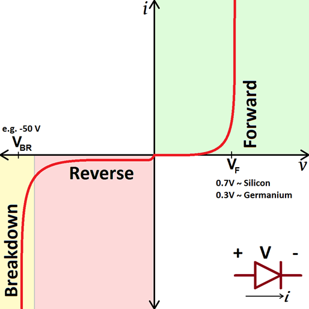
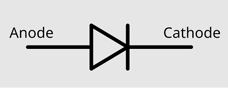
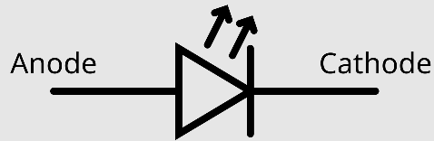
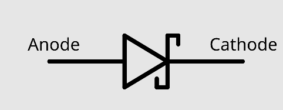
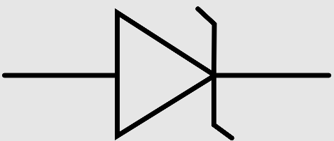
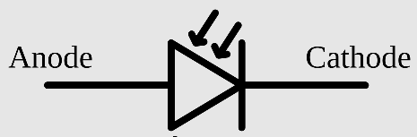
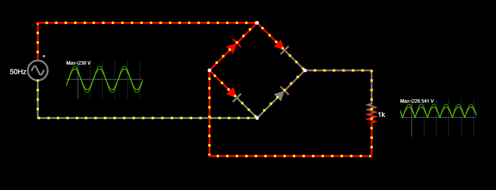
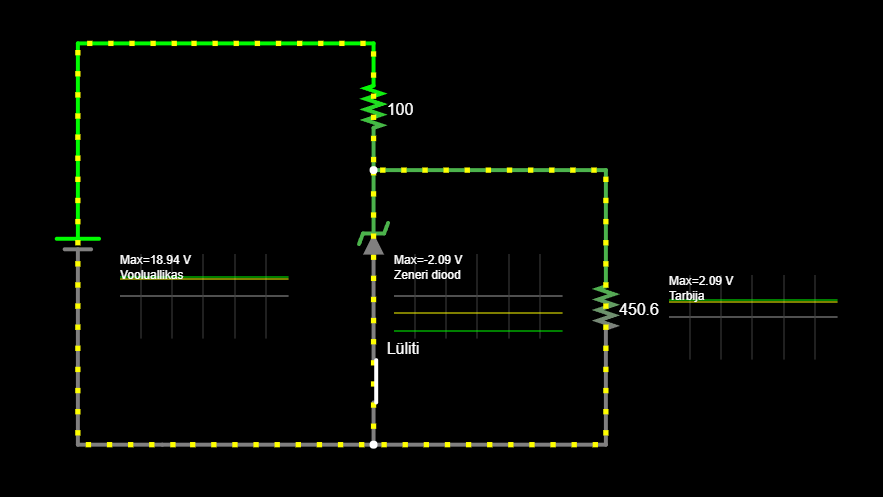

# Dioodid
Diood *(ingl diode)* on kahe viiguga pooljuhtelement, mis juhib elektrivoolu peamiselt ühes suunas. Enamik pooljuhtdioode põhineb p- ja n-tüüpi materjali liitekohal ehk pn-siirdel, kuid näiteks Schottky dioodis kasutatakse metalli ja pooljuhi vahelist siiret. Kui anood on katoodi suhtes positiivsema pingega, on diood päripingestatud ja juhib voolu. Vastupinge korral on vool väga väike kuni läbilöögipingeni, mille ületamine võib tavalist dioodi kahjustada.

Dioode kasutatakse muu hulgas alaldi [vooluahelates](https://github.com/nullyks/Arduino-fyysika-p6hiteadmised/blob/main/materjalid/3_vooluahelad.md) vahelduvvoolu muundamiseks alalisvooluks, signaalide piiramiseks, pinge stabiliseerimiseks ja vooluahelate kaitsmiseks. Spetsiifilised diooditüübid, nagu Zeneri dioodid, on mõeldud pingeregulatsiooniks, [LED-id valguse kiirgamiseks](https://github.com/nullyks/Arduino-ekraanid-ja-led-elemendid/blob/main/materjalid/1_segmentidega_LED_ekraan.md) ja Schottky dioodid kiireks lülitamiseks ning madala pingelanguga rakendusteks.

Järgnev graafik näitab, kuidas dioodi läbiv voolutugevus muutub dioodile rakendatud pinge muutmisel.

## Dioodi olulisemad omadused

**Päripinge ehk päripingelang** *(ingl forward voltage, $V_F$)* – pinge dioodi anoodi ja katoodi vahel, kui dioodi läbib pärivool. Selle väärtus sõltub dioodi tüübist, voolutugevusest ja temperatuurist. Ligikaudsetes arvutustes kasutatakse ränidioodi puhul sageli väärtust 0,7 V ja Schottky dioodi puhul vahemikku 0,2–0,4 V, kuid täpne väärtus tuleb kontrollida andmelehelt.

**Pärivool** *(ingl forward current, $I_F$)* – voolutugevus, mis läbib dioodi pärisuunas. Andmelehel toodud suurimat lubatud pidevat või keskmist pärivoolu ei tohi ületada.

**Läbilöögipinge** *(ingl breakdown voltage, $V_{BR}$)* – vastupinge, mille juures dioodi pöördvool järsult suureneb. Tavaline diood võib läbilöögipiirkonnas kahjustuda. Zeneri diood on kavandatud selles piirkonnas töötama, kuid seda läbivat voolu tuleb piirata.

## Levinud dioodide liigid ja sümbolid

**Signaaldioodid ja võimsusdioodid** – signaaldioode kasutatakse väikese vooluga signaaliahelates ja kiireks lülitamiseks. Võimsusdioodid taluvad suuremat voolu ning tavaliselt ka kõrgemat vastupinget; neid kasutatakse näiteks alaldites ja toiteahelates.
   
* dioodi sümbol:

    
 
**LED ehk valgusdiood** *(ingl light-emitting diode)* – diood, mis kiirgab pärivoolu läbimisel nähtavat või infrapunakiirgust. LED-e kasutatakse näiteks märgutuledes, valgustites, [ekraanides](https://github.com/nullyks/Arduino-ekraanid-ja-led-elemendid/blob/main/materjalid/1_segmentidega_LED_ekraan.md) ja optiliste signaalide edastamiseks, sealhulgas infrapunakaugjuhtimispultides.

* LED sümbol:

    

**Schottky diood** *(ingl Schottky diode)* – metalli ja pooljuhi siirdel põhinev väikese päripingelangu ning kiire lülitumisega diood. Seda kasutatakse näiteks alaldites, toiteahelates, kiiretes lülitusahelates ja kaitseahelates.

* Schottky dioodi sümbol:

    

**Zeneri diood** *(ingl Zener diode)* – diood, mis on kavandatud töötama pöördläbilöögi piirkonnas. Selle klemmipinge püsib ettenähtud vooluvahemikus ligikaudu Zeneri pinge $V_Z$ lähedal. Zeneri dioode kasutatakse näiteks tugipinge tekitamiseks, lihtsaks pinge stabiliseerimiseks ja liigpinge piiramiseks.

* Zeneri dioodi sümbol:

    

**Fotodiood** *(ingl photodiode)* – valgustundlik diood, mis muudab sellele langeva valguse elektriliseks signaaliks. Fotodioode kasutatakse näiteks valgusandurites ja optilises andmesides.
* Fotodioodi sümbol:

  

## Näiteid dioodide kasutamisest
* Nelja dioodi abil moodustatakse täisperioodalaldi ehk dioodisild *(ingl full-wave bridge rectifier)*. See pöörab vahelduvpinge mõlemad poolperioodid väljundis sama polaarsusega, mistõttu saadakse pulseeriv alalispinge. Ühtlasema pinge saamiseks lisatakse [silukondensaator](4_kondensaatorid.md), mida käsitletakse järgmises peatükis.

    
    [Interaktiivne simulatsioon](https://falstad.com/circuit/circuitjs.html?ctz=CQAgjCAMB0l3BWcMBMcUHYMGZIA4UA2ATmIxAUgpABZsKBTAWjDACgA3EJvKlFGt14hCgqhEogUuKLJgI2AEyn5wNQSjx4RGkIoYAzAIYBXADYAXJSu1h1UrVIFS9h05eubtokNkK37FFdjcytlLydBPwDdfRCPAHchKh8In0g2JJ4+Zwj+MUybNQ1VCIyk6OLaYTsCpLRtCJphMrYAJ2rxe2a+R3F4NhpIegRNcGIgwgRCKWnZMEgAfVFFpaHSRew0VegaRZZFlEWFzcHh7i3wMeIZsAm5Zb21yA2tpZg9g6Ol7DYgA)

* Zeneri diood on ühendatud tarbijaga paralleelselt ja pöördpingestatud. Vooluallika ning tarbija vahel olev 100 Ω jadatakisti piirab voolu. Kui sisendpinge ületab Zeneri pinget, hakkab diood juhtima ja hoiab tarbijale mõjuva pinge ligikaudu 2,1 V juures. Muuda simulatsioonis toitepinget ja tarbija takistust ning võrdle tulemust sisselülitatud ja väljalülitatud Zeneri dioodiga.

    

    [Interaktiivne simulatsioon](https://falstad.com/circuit/circuitjs.html?ctz=CQAgjCAMB0l3BWcMBMcUHYMGZIA4UA2ATmIxAUgpABZsKBTAWjDACgA3EJvK7BFN1608UMTSp5ooqrOgI22GiABeDAHYMATk0EQw0DGDoC8YYijPwUzclRSx4T5-mV62K8DTcJCX5cZuqhraumwA7v5R2GhRkBHRAiAxfEnxkSx+-HreyWkJPKmCmXmC8VrJsYGVReKU8goV1c25NDLI6UJUbVE98RL02ISiKCjKNMR+lu2EAPqENLOQsxKkswhLsGAoGyyzKPOz2LMAKgCGWgBGAJYAVmdsA+CE9vgg0+8YZeDzi8urxH28k2Bz2BzAR1mAC0QlprgAdADOABNrgB7NHItiIqI7PzVbK0MQAMzOABtEQwQAAZAA-ZOuABdro9IPQmD00KJhJhvssFksVpA1mgQbMwYLjgA1DFkgCu5IZAGszojFKI-AAxCBUfTwbgQc5XO5nJGMs5K66IxlytXYdrasQQCQGkAytHygAO13UAHMGGwgA)
