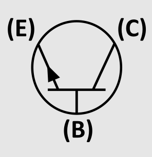
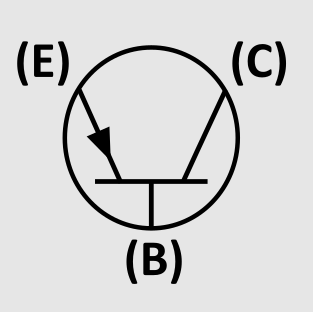
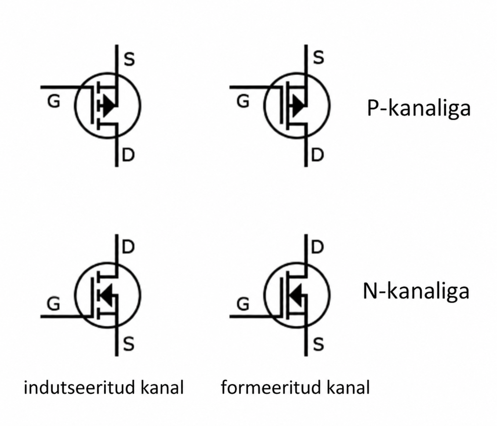
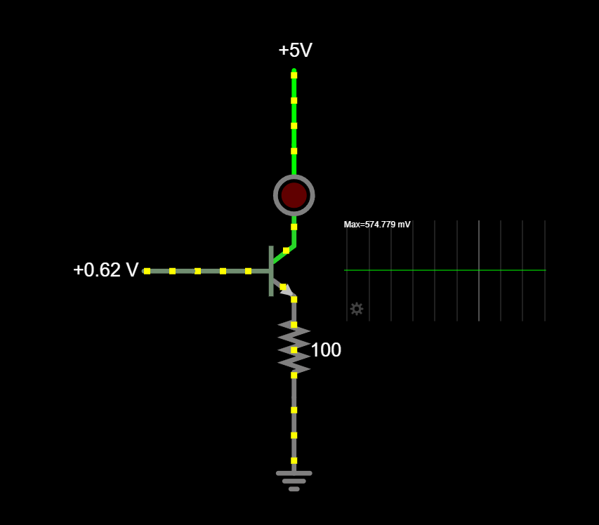
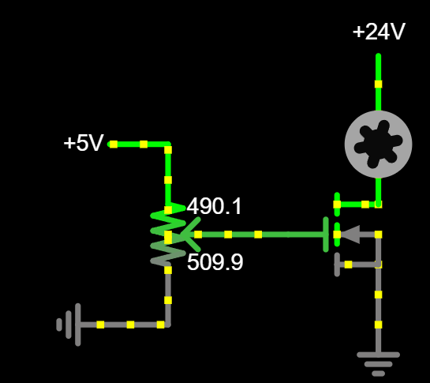

# Transistorid

Transistor *(ingl transistor)* on pooljuhtelement, mida kasutatakse elektroonikas lüliti või võimendina. Levinud transistorirühmad on bipolaartransistorid *(ingl bipolar junction transistor, BJT)* ja väljatransistorid *(ingl field-effect transistor, FET)*. BJT-l on kaks pn-siiret ning selle juhtimiseks kasutatakse baasielektroodi. FET-is juhitakse lätte ja neelu vahelist voolu paisu tekitatud elektrivälja abil.

Transistoreid kasutatakse alates lihtsatest loogikalülitustest kuni keerukate mikroprotsessoriteni. Need on peamised komponendid võimendites, ostsillaatorites ja lülitites. Tänu oma väikesele suurusele ja energiatõhususele on transistorid kaasaegsete integraallülituste *(ingl Integrated circuit, IC)* aluseks, võimaldades arvutite, mobiiltelefonide ja muude digiseadmete arengut.

## Transistori olulisemad omadused

**Vooluvõimendustegur** *(ingl DC current gain, $h_{FE}$ või $\beta$)* – näitab aktiivrežiimis kollektori- ja baasivoolu ligikaudset suhet: $\beta \approx I_C/I_B$. Selle väärtus sõltub transistorist, töövoolust ja temperatuurist.

**Lävipinge *(ingl threshold voltage,* $V_{GS(th)}$ *)*** – MOSFET-i
paisu ja lätte vaheline pinge, mille juures tekib andmelehel määratud väike
neeluvool. Läviväärtus ei tähenda, et MOSFET oleks täielikult avatud.
Lülitusrakenduse jaoks sobiv paisu-lätte pinge valitakse andmelehel toodud
avatud kanali takistuse $R_{DS(on)}$ järgi.

**Hajuvõimsus** *(ingl power dissipation, $P_D$ või $P_{tot}$)* – transistoris soojuseks muutuv võimsus. Andmelehel esitatud suurim lubatud hajuvõimsus sõltub töötemperatuurist ja jahutustingimustest.

**Läbilöögipinge** *(ingl breakdown voltage)* – pinge, mille ületamisel võib transistoris tekkida läbilöök ja transistor kahjustuda. Lubatud pinge sõltub sellest, milliste viikude vahelist pinget vaadeldakse, ning täpne väärtus tuleb kontrollida andmelehelt.

**Lekkevool** *(ingl leakage current)* – väike vool, mis läbib transistorit ka väljalülitatud olekus. Lekkevool sõltub transistori tüübist ja temperatuurist ning selle väärtus on esitatud andmelehel.

**Takistused *(ingl input/output impedance)*** – Sisend- ja väljundtakistused määravad, kuidas transistor sobitub teiste vooluringi komponentidega, mõjutades signaali kvaliteeti ja energia ülekannet.

### Bipolaartransistorite kasutamine
Bipolaartransistoritel on kolm viiku, mida nimetatakse:
* Baas *(ingl base, B)*
* Kollektor *(ingl collector, C)*
* Emitter *(ingl emitter, E)*

Bipolaartransistorid jagunevad NPN ja PNP transistoriteks. Nende viikudele langevate pingete (V) ja transistori töörežiimi suhet kirjeldab järgmine tabel:
| Pinged viikudel | NPN | PNP |
| :--- | :---: | :---:|
| $V_E < V_B < V_C$ | aktiivrežiim | pöördaktiivrežiim |
| $V_E < V_B > V_C$ | küllastusrežiim | sulgerežiim |
| $V_E > V_B < V_C$ | sulgerežiim | küllastusrežiim |
| $V_E > V_B > V_C$ | pöördaktiivrežiim | aktiivrežiim |

**Märkus.** Tabel näitab viigupingete suhtelist järjestust. Ränist NPN-transistori juhtimiseks peab baasi pinge olema emitteri pingest tavaliselt ligikaudu 0,6–0,7 V kõrgem; PNP-transistori korral ligikaudu sama palju madalam. Täpne väärtus sõltub transistorist, voolust ja temperatuurist.

* **aktiivrežiim** – baas-emitteri siiret läbib baasivool: NPN-transistoris baasilt emitterile ja PNP-transistoris emitterilt baasile. Kollektorivool on ligikaudu võrdeline baasivooluga ning sõltub transistori vooluvõimendustegurist.
* **küllastusrežiim** – transistor on lülitina täielikult sisse lülitatud. Kollektorivoolu piirab siis peamiselt väline vooluahel ning kollektori ja emitteri vaheline pinge $V_{CE(sat)}$ on väike.
* **sulgerežiim** – transistor on välja lülitatud. Baas-emitteri siire praktiliselt ei juhi ning kollektorharus esineb ainult väga väike lekkevool.
* **pöördaktiivrežiim** – kollektori ja emitteri rollid on tavapärase aktiivrežiimiga võrreldes vahetunud. Transistori vooluvõimendustegur on selles režiimis palju väiksem ning tavapärastes lülitustes seda režiimi üldjuhul ei kasutata.

### Väljatransistorite kasutamine (MOSFET näitel)

MOSFET-idel on tavaliselt kolm välisviiku:
* Läte *(ingl source, S)*
* Neel *(ingl drain, D)*
* Pais *(ingl gate, G)*

Väljatransistorite ehitus ja tööpõhimõte erinevad bipolaartransistorite omast.
Järgnev selgitus on lihtsustatud.

MOSFET-id võivad olla N- või P-kanaliga. Kanali ehituse järgi jagunevad need
omakorda kaheks:

* **indutseeritud kanaliga MOSFET** *(ingl enhancement-mode MOSFET)* on
  paisu-lätte nullpinge korral tavaliselt välja lülitatud;
* **formeeritud kanaliga MOSFET** *(ingl depletion-mode MOSFET)* juhib
  paisu-lätte nullpinge korral voolu.

MOSFET-i juhtivust mõjutab paisu ja lätte vaheline pinge $V_{GS}$, mitte paisu
absoluutne pinge. Lihtsustatud seosed on järgmised:

| MOSFET-i liik | Käitumine, kui $V_{GS}=0$ | Juhtivuse suurendamine |
|---|---|---|
| N-kanaliga, indutseeritud kanaliga | ei juhi | positiivne $V_{GS}$ |
| P-kanaliga, indutseeritud kanaliga | ei juhi | negatiivne $V_{GS}$ |
| N-kanaliga, formeeritud kanaliga | juhib | positiivne $V_{GS}$ |
| P-kanaliga, formeeritud kanaliga | juhib | negatiivne $V_{GS}$ |

Formeeritud kanaliga MOSFET-i juhtivust saab vastupidise polaarsusega
paisu-lätte pingega vähendada. Konkreetse MOSFET-i lubatud pinged,
lülitamiseks vajalik $V_{GS}$ ja avatud kanali takistus tuleb alati kontrollida
andmelehelt.

## Levinud transistorite liigid ja sümbolid

**Bipolaartransistor** *(ingl Bipolar junction transistor)* - kasutatakse näiteks võimendites, ostsillaatorites ja pingeregulaatorites.
  
* NPN bipolaartransistori sümbol:

    

* PNP bipolaartransistori sümbol:
    
    

**MOSFET-id** *(ingl metal–oxide–semiconductor field-effect transistor)* - kasutatakse näiteks toiteallikates ja mootoriajamites.

* MOSFET-ide sümbolid:

    

## Näiteid transistorite kasutamisest

* NPN-transistor juhib LED-i heledust. Baasi ja emitteri vaheline pinge tekitab baasivoolu, mis omakorda juhib LED-i läbivat kollektorivoolu.

    [Interaktiivne simulatsioon](https://falstad.com/circuit/circuitjs.html?ctz=CQAgjCAMB0l3BWcMBMcUHYMGZIA4UA2ATmIxAUgpABZsKBTAWjDACgxCUQU89xi3XvxQJCPEABMGAMwCGAVwA2AFyZKGk8FB0xI7FTxQ0eGIX1PcqEJimh5iYxxjDE82TnnIwEGGlmJsDEggwgQUN2QqaXllFTYAJR4LV3N+MF5dWiokKjzoBDYAc2T+bHDS7LyoRKMTTG4wDHEGrJp8riyfNgAnSuFK8qsotnb6bDQedtoaMsgTawB9QhpF1YyIsEWfPwCgkObwt23YOC2WRfZsfhMAMQhq7hYQAAUASwA7IoYAHQBnABGcjkfzeGjYQA)

* N-kanaliga MOSFET [juhib mootori kiirust](https://github.com/nullyks/Arduino-mootorid-ja-toide/blob/main/materjalid/1_Alalisvoolumootorid.md). Potentsiomeetri asend muudab paisu ja lätte vahelist pinget $V_{GS}$, mis mõjutab MOSFET-i juhtivust ja mootorit läbivat voolu.

    **Märkus.** Tegemist on lihtsustatud näitega. Päris vooluahelas tuleb mootori tekitatavate pingeimpulsside eest kaitsmiseks ühendada mootoriga rööbiti kaitsediood.

    

    [Interaktiivne simulatsioon](https://falstad.com/circuit/circuitjs.html?ctz=CQAgjCAMB0l3BWEBmAHAJmgdgGzoRmACzICcpkORICkNIJNApgLRhgBQASiOqquFLpe-cDjoSGddNUkwEHAOYiBfVaOTIcUKN3C5eM8H0OydROkjnQFAM14XeWYWqfDkwsDaix0HImBIrmBCKrwI2hLeEDCBPnEwkMKJSGBwumBY1Jna6EZ51MiQ2eDwPgghAgAKAPYALkwAdnUAzgCWNQC2TEx1AE5tIACGLU0AJhwA7qZuDtLOuso5KOh0YCYechxAA)
