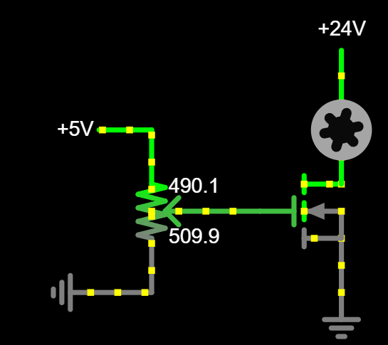

# Transistorid

Transistor on pooljuhtelement, mis toimib elektroonikas lüliti või võimendina. See koosneb tavaliselt kolmest kihist pooljuhtmaterjalist, mille vahel on kaks pn-siiret. Transistorid võivad olla bipolaartransistorid *(ingl bipolar junction transistor, BJT)* või väljatransistorid *(ingl field-effect transistor, FET)*, sõltuvalt nende ehitusest ja tööpõhimõttest. BJT puhul juhitakse voolu baasielektroodi *(ingl base)* kaudu, samas kui FET kasutab paisuelektroodi *(ingl gate)*. Transistorid võimaldavad täpset voolu ja pinge juhtimist vooluahelates.

Transistoreid kasutatakse laialdaselt erinevates elektroonikaseadmetes, alates lihtsatest loogikalülitustest kuni keerukate mikroprotsessoriteni. Need on peamised komponendid võimendites, ostsillaatorites ja lülitites. Tänu oma väikesele suurusele ja energiatõhususele on transistorid kaasaegsete integraallülituste *(ingl Integrated circuit, IC)* aluseks, võimaldades arvutite, mobiiltelefonide ja muude digiseadmete arengut.

## Transistori olulisemad omadused

**Võimendustegur *(ingl gain)*** – Näitab, kui palju transistor võimendab sisendvoolu. Bipolaarsete transistorite puhul tähistatakse seda $h_{FE}$ või $\beta$.

**Lävipinge *(ingl threshold voltage, $ V_{th} $ )*** – Väljatransistorite puhul määrab see pinge, millest alates transistor hakkab juhtima voolu. 

**Töövõimsus *(ingl power dissipation)*** – Maksimaalne võimsus, mida transistor suudab hajutada ilma ülekuumenemiseta. Mõjutab seadme töökindlust ja jahutusvajadust.

**Läbimurdepinge *(ingl breakdown voltage)*** – Maksimaalne pinge, mida transistor talub ilma purunemata. Oluline võimsusrakendustes ja kõrgepinge-elektroonikas.

**Lekkevool *(ingl leakage current)*** – Väike vool, mis läbib transistorit isegi siis, kui see peaks olema välja lülitatud. Mida väiksem on lekkevool, seda energiatõhusam on transistor.

**Takistused *(ingl input/output impedance)*** – Sisend- ja väljundtakistused määravad, kuidas transistor sobitub teiste vooluringi komponentidega, mõjutades signaali kvaliteeti ja energia ülekannet.

### Bipolaartransistorite kasutamine
Bipolaartransistoritel on kolm viiku, mida nimetatakse:
* Baas *(ingl base, B)*
* Kollektor *(ingl collector, C)*
* Emitter *(ingl emitter, E)*

Bipolaartransistorid jagunevad NPN ja PNP transistoriteks. Nende viikudele langevate pingete (V) ja transistori töörežiimi suhet kirjeldab järgmine tabel:
| Pinged viikudel | NPN | PNP |
| :--- | :---: | :---:|
| $V_E < V_B < V_C$ | aktiivrežiim | pöördaktiivrežiim |
| $V_E < V_B > V_C$ | küllastusrežiim | sulgerežiim |
| $V_E > V_B < V_C$ | sulgerežiim | küllastusrežiim |
| $V_E > V_B > V_C$ | pöördaktiivrežiim | aktiivrežiim |

* **aktiivrežiim** - Transistor juhib voolu. Vool kollektori ja emitteri vahel on proportsionaale vooluga baasilt emitterile (korrutatuna transistori võimedusteguriga). 
* **küllastusrežiim** - Transistor juhib voolu maksimaalselt. Takistus kollektori ja emitter vahel on minimaalne.
* **sulgerežiim** - Takistus kollektori ja emitteri vahel on nii suur, et transistor ei juhi praktiliselt üldse voolu.
* **pöördaktiivrežiim** - Transistor töötab vastupidiselt aktiivrežiimile. Võimendustegur on palju väiksem kui aktiivrežiimis. Tavaliselt on see veaolukord. 

### Väljatransistorite kasutamine (MOSFET näitel)

MOSFET väljatransistoritel on kolm viiku, mida nimetatakse:
* Läte *(ingl source, S)*
* Neel *(ingl drain, D)*
* Pais *(ingl gate, G)*

Väljatransistorite ehitus ja tööpõhimõte on oluliselt keerulisem bipolaartransistorite tööpõhimõttest. Järgnev seletus on oluliselt lihtsustatud ja seetõttu teatud detailides ebatäpne.

MOSFET transistorid jagunevad N-kanaliga ja P-kanaliga MOSFET-ideks. Need jagunevad veel omakorda küllustusrežiimil töötavateks *(ingl enhancement mode)* ja vaegustusrežiimil *(ingl depletion mode)* töötavateks.  Paisule mõjuv pinge mõjutab tranistori juhtivust järgmiselt

| MOSFETi tüüp | $V_{G}<0$ | $V_{G}=0$ |$V_{G}>0$ |
| :--- | :---: | :---:| :---:|
| N-kanaliga, vaesustusrežiim | EI JUHI| JUHIB (D->S) | JUHIB (D->S)|
| N-kanaliga, küllastusrežiim | EI JUHI | EI JUHI | JUHIB (D->S)|
| P-kanaliga, vaesustusrežiim | JUHIB (S->D) | JUHIB (S->D) | EI JUHI | 
| P-kanaliga, küllastusrežiim | JUHIB (S->D) | EI JUHI | EI JUHI|

## Levinud transistorite liigid ja sümbolid

**Bipolaartransistor** *(ingl Bipolar junction transistor)* - kasutatakse näiteks võimendites, ostsillaatorites ja pingeregulaatorites.
  
* NPN bipolaartransistori sümbol:

    

* PNP bipolaartransistori sümbol:
    
    

**MOSFET transistorid** *(ingl metal–oxide–semiconductor field-effect transistor)* - kasutatakse näiteks toiteallikates ja mootoriajamites.

* MOSFET transistorite sümbolid:

    

## Näiteid transistorite kasutamisest

* Bipolaarse NPN transistoriga juhitakse LEDi heledust läbi transistori baasile langeva pinge.

    [Interaktiivne simulatsioon](https://falstad.com/circuit/circuitjs.html?ctz=CQAgjCAMB0l3BWcMBMcUHYMGZIA4UA2ATmIxAUgpABZsKBTAWjDACgxCUQU89xi3XvxQJCPEABMGAMwCGAVwA2AFyZKGk8FB0xI7FTxQ0eGIX1PcqEJimh5iYxxjDE82TnnIwEGGlmJsDEggwgQUN2QqaXllFTYAJR4LV3N+MF5dWiokKjzoBDYAc2T+bHDS7LyoRKMTTG4wDHEGrJp8riyfNgAnSuFK8qsotnb6bDQedtoaMsgTawB9QhpF1YyIsEWfPwCgkObwt23YOC2WRfZsfhMAMQhq7hYQAAUASwA7IoYAHQBnABGcjkfzeGjYQA)

* N-kanaliga MOSFET juhib mootori kiirust, sõltudes potentsiomeetri asendist ja seeläbi paisule langevast pingest.

    

    [Interaktiivne simulatsioon](https://falstad.com/circuit/circuitjs.html?ctz=CQAgjCAMB0l3BWEBmAHAJmgdgGzoRmACzICcpkORICkNIJNApgLRhgBQASiOqquFLpe-cDjoSGddNUkwEHAOYiBfVaOTIcUKN3C5eM8H0OydROkjnQFAM14XeWYWqfDkwsDaix0HImBIrmBCKrwI2hLeEDCBPnEwkMKJSGBwumBY1Jna6EZ51MiQ2eDwPgghAgAKAPYALkwAdnUAzgCWNQC2TEx1AE5tIACGLU0AJhwA7qZuDtLOuso5KOh0YCYechxAA)