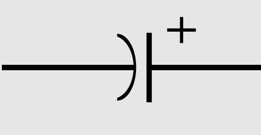
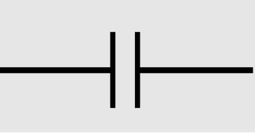
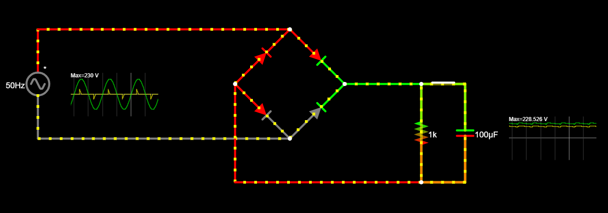
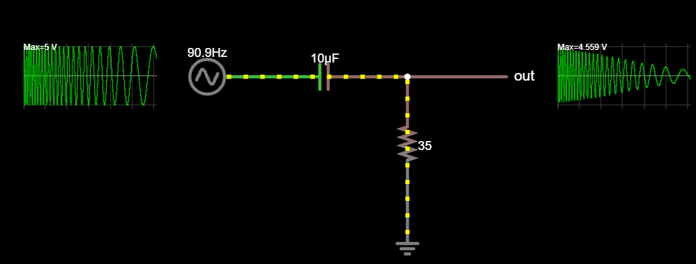
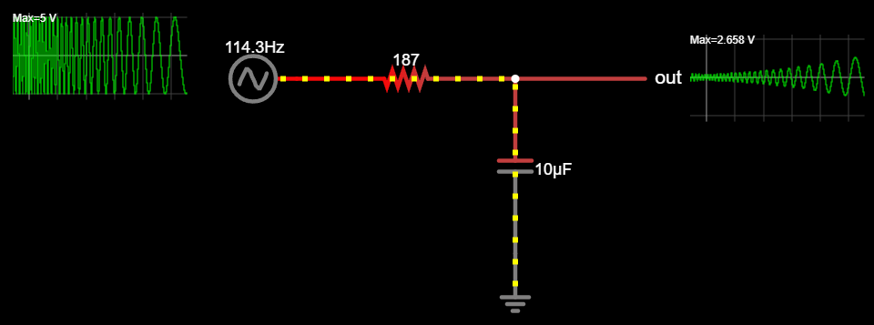

# Kondensaatorid
Kondensaator *(ingl Capacitor)* on elektroonika baaselement, mis koosneb kahest juhtivast plaadist, mida eraldab dielektriline materjal. See komponent on võimeline salvestama ja vabastama elektrilaengut, toimides ajutise energiahoidlana. Kondensaatori laadumise ja tühjenemise protsess sõltub selle mahtuvusest, mida mõõdetakse faradites (F). Erinevalt takistitest ei muuda kondensaator püsivalt elektrienergiat soojuseks, vaid hoiab ja vabastab seda vastavalt vooluringi vajadustele.

Kondensaatoreid kasutatakse laialdaselt erinevates elektroonikaseadmetes. Need stabiliseerivad pinget ja filtreerivad voolu, näiteks toiteplokkides, kus need siluvad alalisvoolu pinge kõikumisi. Samuti rakendatakse neid raadiosagedusringides signaalide edastamiseks ja vastuvõtmiseks, samuti ajastuse ja sagedusfiltrite loomisel. Lisaks kasutatakse kondensaatoreid impulssenergia salvestamiseks ja kiireks vabastamiseks, näiteks kaameravälkudes ja impulsslülitustes.

## Kondensaatori olulisemad omadused

**Mahutavus *(ingl Capacitance)*** – Näitab, kui palju elektrilaengut kondensaator suudab salvestada antud pinge juures. Mõõtühik on farad (F), kuid tavaliselt kasutatakse väiksemaid ühikuid nagu mikrofarad (µF), nanofarad (nF) või pikofarad (pF).

**Nimipinge *(ingl Rated Voltage)*** – Suurim pinge, mida kondensaator talub ilma rikke või läbimurdeteta. Seda väljendatakse voltdes (V) ja see võib erineda alalis- ja vahelduvoolu puhul.

**Mahutavustolerants *(ingl Capacitance Tolerance)*** – Näitab, kui palju tegelik mahutavus võib erineda nimiväärtusest. Tavaliselt väljendatakse protsentides (nt ±10%).

**Isolatsioonitakistus *(Insulation Resistance)*** – Määrab, kui hästi kondensaator suudab takistada voolu lekkimist läbi dielektriku, väljendatakse oomides (Ω).

**Lekkevool *(ingl Leakage Current)*** – Väike vool, mis lekib läbi dielektriku, eriti oluline elektrolüütkondensaatorite puhul.

## Levinud kondensaatorite liigid ja sümbolid
Kondensaatorid võivad olenevalt materjalist ja konstruktsioonist olla polariseeritud või mittepolariseeritud.

Polariseeritud kondensaatorid on sellised, millel on kindel positiivne ja negatiivne viik, mis tuleb õigesti ühendada. Kui need ühendatakse valepidi, võib see põhjustada ülekuumenemist või isegi rikke. Peamised polariseeritud kondensaatorid on elektrolüütkondensaatorid, sealhulgas alumiinium- ja tantaal-elektrolüütkondensaatorid, mida kasutatakse toiteplokkides, pingefiltrites ja energiasalvestuses. Samuti kuuluvad siia superkondensaatorid, mis suudavad talletada väga suuri laenguid ja vabastada neid kiiresti.

* Polariseeritud kondensaatori sümbol:
    

Mittepolariseeritud kondensaatorid on need, mida saab vooluringi ühendada mõlemat pidi, kuna neil ei ole kindlat polaarsust. Neid kasutatakse peamiselt vahelduvvoolu ja kõrgsagedusrakendustes, kus oluline on signaali täpne edastamine ja filtreerimine. Levinumad mittepolariseeritud kondensaatorid on keraamilised kondensaatorid, mis sobivad näiteks signaalitöötluseks ja raadiosagedusringides, ning filmkondensaatorid, mida kasutatakse audioseadmetes ja võrgufiltrites. Samuti kuuluvad siia mika-kondensaatorid, mida kasutatakse täpsetes mõõteseadmetes ja raadiosagedusvõimendites.

* Mittepolariseeritud konsendsaatori sümbol:
    

## Näiteid kondensaatorite kasutamisest

* Kondensaator alalisvoolu pinge stabiliseerijana dioodisilla juures. Võrdle tarbijale mõjuvat pinget ilma kondensaatorita avades lüliti.

[Interaktiivne simulatsioon](https://falstad.com/circuit/circuitjs.html?ctz=CQAgjCAMB0l3BWcMBMcUHYMGZIA4UA2ATmIxAUgpABZsKBTAWjDACgA3EJvKlFGt14hCgqhEogUuKLJgI2AEyn5wNQSjx4RGkIoYAzAIYBXADYAXJSu1h1UrVIFS9h05eubtokNkK37FFdjcytlLydBPwDdfRCPAHchKh8In0g2JJ4+Zwj+MUybNQ1VCIyk6OLaYTsCpLRtCJphMrYAJ2rxe2a+R3F4NhpIekJVMGIgnEIpBGn+gH1Rech5odJ57DRl6Bp5lnmUebAV7EHh7k3wTRBiafGgqhWllbXiDa2wFGg8PbAD5Y2bAAxhR7LVQRpHGJYPBSHD4QjSE48NAEERWAgMHgMCg7HMYRByp0HNoEIE+mwAM7E8FkwTgx4gYxmSkMNhAA)

* Kondensaatori kasutamine signaalifiltrites. Kasutatakse ära kondensaatori omadust lasta läbi kõrge sagedusega vahelduvvoolu.

    * Kõrgpääsfilter *(ingl High-Pass filter)* - filtreerib signaalist välja madalsageduse:
    

        [Interaktiivne simulatsioon](https://falstad.com/circuit/circuitjs.html?ctz=CQAgjCAMB0l3BWEA2aAWB8CcBmSy0AOBBAdkJE0sskoFMBaMMAKAGMQAmNWsZWnr34g0UWPAhhYCDKVIkszMGiwyxcCJBYAnEXHDDBXQhVo4ELAPJ6htBGE4HazlgHMbxikZydnUFmCktNy2XJAUfGZh4PDUMKw8OJRoog4UyKSOYFiOwQD6BHmQeTxYWHkIRdBgeUx5CZBJPuCcEcLZuSIFaEUlkFiEFVWctTUjPTgsABYgSZosQA)
    * Madalpääsfilter *(ingl Low-Pass filter)*- filtreerib signaalist välja kõrgsageduse:
    
        [Interaktiivne simulatsioon](https://falstad.com/circuit/circuitjs.html?ctz=CQAgjCAMB0l3BWEA2aAWB8CcBmSy0AOBBAdkJE0sskoFMBaMMAKAHkQ05xlaEwATD1oiWAc07cBhCl1o4BIqCwBOIAV2GTaYXlHCFSLAMbatc9TM5RY8CDH5hS8QnKwYEaG3HssntDR09RQpdeXUdeGoYVi4cSmlwROQEZHAsIREAfQIsyCyuLCwshDzoMCymLNjIeIVwQS0nNNo0HLb8wsISsshSqoECrJwWAAsQeKERoA)
