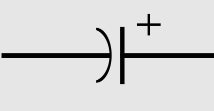
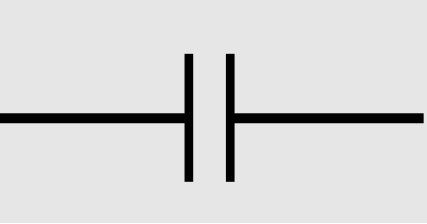
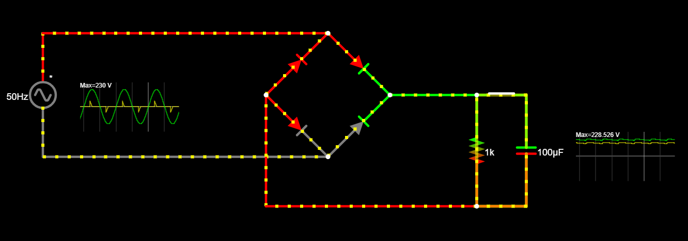
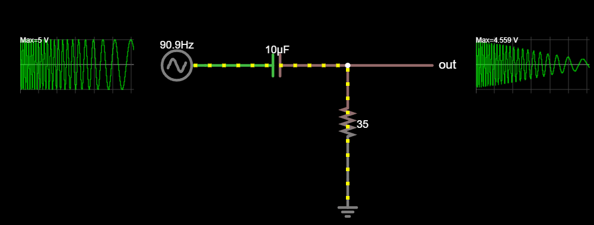
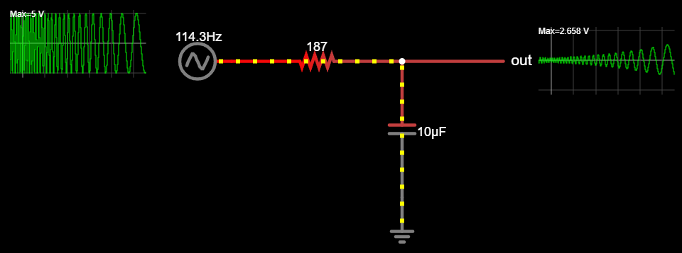

# Kondensaatorid
Kondensaator *(ingl Capacitor)* on elektroonika baaselement, mis koosneb kahest juhtivast plaadist, mida eraldab dielektriline materjal. See komponent on võimeline salvestama ja vabastama elektrilaengut, toimides ajutise energiahoidlana. Kondensaatori laadumise ja tühjenemise kiirus sõltub nii selle mahtuvusest kui ka vooluahela takistusest. Mahtuvust mõõdetakse faradites (F). Kondensaator salvestab elektrienergiat elektriväljas ja võib selle hiljem vooluahelasse tagasi anda. Tegelikus kondensaatoris muutub väike osa energiast siiski soojuseks.

Kondensaatoreid kasutatakse toiteahelates pinge silumiseks ja häirete filtreerimiseks, signaalide sidestamiseks ning ajastus- ja filtriahelates. Raadiosagedusahelates aitavad need valida ja kujundada sagedusi. Kondensaatoreid kasutatakse ka impulssenergia salvestamiseks ja kiireks vabastamiseks, näiteks kaameravälgus.

## Kondensaatori olulisemad omadused

**Mahutavus *(ingl Capacitance)*** – Näitab, kui palju elektrilaengut kondensaator suudab salvestada antud pinge juures. Mõõtühik on farad (F), kuid tavaliselt kasutatakse väiksemaid ühikuid nagu mikrofarad (µF), nanofarad (nF) või pikofarad (pF).

**Nimipinge** *(ingl rated voltage)* – suurim pinge, millega kondensaatorit tohib ettenähtud tingimustes kasutada. Nimipinge ületamine võib kahjustada dielektrikut ja kondensaatori rikkuda.

**Mahutavustolerants *(ingl Capacitance Tolerance)*** – Näitab, kui palju tegelik mahutavus võib erineda nimiväärtusest. Tavaliselt väljendatakse protsentides (nt ±10%).

**Isolatsioonitakistus** *(ingl insulation resistance)* – iseloomustab voolu lekkimist läbi kondensaatori dielektriku. Suurem isolatsioonitakistus tähendab väiksemat lekkevoolu; selle väärtust väljendatakse oomides (Ω).

**Lekkevool** *(ingl leakage current)* – väike alalisvool, mis läbib laetud kondensaatori dielektrikut. Suurem lekkevool põhjustab kondensaatori kiiremat iseeneslikku tühjenemist.

## Levinud kondensaatorite liigid ja sümbolid
Kondensaatorid võivad olenevalt materjalist ja konstruktsioonist olla polariseeritud või mittepolariseeritud.

Polariseeritud kondensaatorid on sellised, millel on kindel positiivne ja negatiivne viik, mis tuleb õigesti ühendada. Kui need ühendatakse valepidi, võib see põhjustada ülekuumenemist või isegi rikke. Peamised polariseeritud kondensaatorid on elektrolüütkondensaatorid, sealhulgas alumiinium- ja tantaal-elektrolüütkondensaatorid, mida kasutatakse toiteplokkides, pingefiltrites ja energiasalvestuses. Samuti kuuluvad siia superkondensaatorid, mille mahtuvus on tavaliste kondensaatorite omast palju suurem ja mis suudavad seetõttu salvestada rohkem energiat.

* Polariseeritud kondensaatori sümbol:

    

Mittepolariseeritud kondensaatoreid saab vooluahelasse ühendada mõlemat pidi, sest neil ei ole kindlat polaarsust. Neid kasutatakse muu hulgas toitepinge häirete vähendamiseks ning signaali-, filtri- ja ajastusahelates. Levinud mittepolariseeritud tüübid on keraamilised, film- ja mikakondensaatorid.

* Mittepolariseeritud kondensaatori sümbol:

    

## Näiteid kondensaatorite kasutamisest

* Kondensaator silub dioodisilla pulseerivat väljundpinget. Ava simulatsioonis lüliti, et kondensaator vooluahelast eemaldada, ning võrdle tarbijale mõjuva pinge kuju ühendatud ja eemaldatud kondensaatori korral.

[Interaktiivne simulatsioon](https://falstad.com/circuit/circuitjs.html?ctz=CQAgjCAMB0l3BWcMBMcUHYMGZIA4UA2ATmIxAUgpABZsKBTAWjDACgA3EJvKlFGt14hCgqhEogUuKLJgI2AEyn5wNQSjx4RGkIoYAzAIYBXADYAXJSu1h1UrVIFS9h05eubtokNkK37FFdjcytlLydBPwDdfRCPAHchKh8In0g2JJ4+Zwj+MUybNQ1VCIyk6OLaYTsCpLRtCJphMrYAJ2rxe2a+R3F4NhpIekJVMGIgnEIpBGn+gH1Rech5odJ57DRl6Bp5lnmUebAV7EHh7k3wTRBiafGgqhWllbXiDa2wFGg8PbAD5Y2bAAxhR7LVQRpHGJYPBSHD4QjSE48NAEERWAgMHgMCg7HMYRByp0HNoEIE+mwAM7E8FkwTgx4gYxmSkMNhAA)

* Kondensaatori mõju signaalile sõltub signaali sagedusest. Kondensaatorit ja takistit erinevalt ühendades saab nõrgendada kas madalama või kõrgema sagedusega signaalikomponente.

    * **Kõrgpääsfilter** *(ingl high-pass filter)* – laseb kõrgema sagedusega signaalikomponendid paremini läbi ja nõrgendab madalama sagedusega komponente:
    

        [Interaktiivne simulatsioon](https://falstad.com/circuit/circuitjs.html?ctz=CQAgjCAMB0l3BWEA2aAWB8CcBmSy0AOBBAdkJE0sskoFMBaMMAKAGMQAmNWsZWnr34g0UWPAhhYCDKVIkszMGiwyxcCJBYAnEXHDDBXQhVo4ELAPJ6htBGE4HazlgHMbxikZydnUFmCktNy2XJAUfGZh4PDUMKw8OJRoog4UyKSOYFiOwQD6BHmQeTxYWHkIRdBgeUx5CZBJPuCcEcLZuSIFaEUlkFiEFVWctTUjPTgsABYgSZosQA)
    * **Madalpääsfilter** *(ingl low-pass filter)* – laseb madalama sagedusega signaalikomponendid paremini läbi ja nõrgendab kõrgema sagedusega komponente:
    
        [Interaktiivne simulatsioon](https://falstad.com/circuit/circuitjs.html?ctz=CQAgjCAMB0l3BWEA2aAWB8CcBmSy0AOBBAdkJE0sskoFMBaMMAKAHkQ05xlaEwATD1oiWAc07cBhCl1o4BIqCwBOIAV2GTaYXlHCFSLAMbatc9TM5RY8CDH5hS8QnKwYEaG3HssntDR09RQpdeXUdeGoYVi4cSmlwROQEZHAsIREAfQIsyCyuLCwshDzoMCymLNjIeIVwQS0nNNo0HLb8wsISsshSqoECrJwWAAsQeKERoA)
