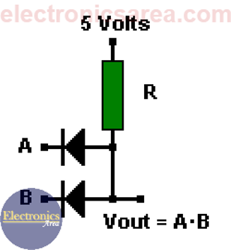
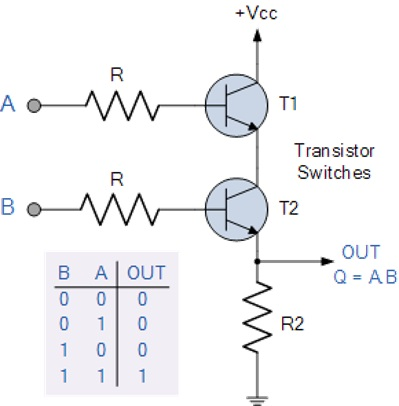
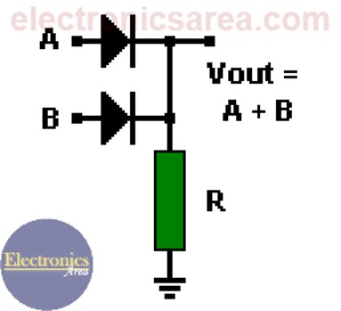
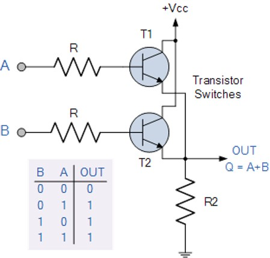
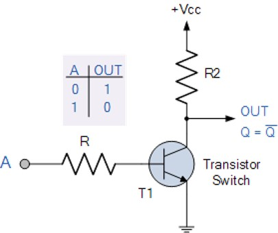
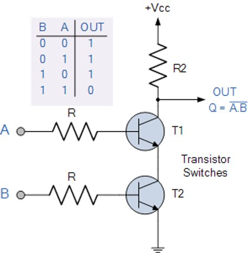
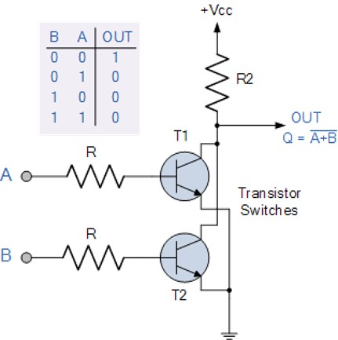

# Loogikalülitused
Loogikalülitused AND (JA), OR (VÕI), NOT (EI), NAND (NING-EI) ja NOR (VÕI-EI) on elektroonikas ja digitaalloogikas peamised komponendid, mille abil töödeldakse kahendsüsteemi signaale (0 ja 1). Neid loogikalülitusi kasutatakse laialdaselt arvutite ja muude digitaalsete seadmete loogika- ja juhtimisahelates. AND- ja OR-lülitused on põhilised ehitusplokid kombinatoorsetes loogikaskeemides, mis võimaldavad erinevate tingimuste põhjal teha otsuseid. NOT-lülitust kasutatakse signaalide ümberpööramiseks ja loogiliste tingimuste muutmiseks. NAND ja NOR on olulised, kuna nende kombinatsioonidega saab luua mistahes loogikafunktsiooni, mistõttu neid nimetatakse universaalseteks lülitusteks. Näiteks protsessorites ja mäluahelates kasutatakse NAND-väravaid, kuna need on lihtsad ja ökonoomsed. NOR-lülitusi võib leida näiteks mikroprotsessorite juhtloogikas ja registrites, kus need aitavad hallata andmevooge ja tingimuslikke otsuseid.

## AND (JA)
JA-lülitus *(ingl AND)* on loogikalülitus, mis annab kõrge väljundi (1) ainult siis, kui kõik tema sisendid on samuti kõrged (1). Kui vähemalt üks sisenditest on madal (0), on ka väljund madal (0). Matemaatiliselt väljendatakse seda operaatoriga "*", kus A * B = 1 ainult siis, kui A = 1 ja B = 1. JA-lülitust kasutatakse laialdaselt digitaalsetes vooluahelates, kus on vaja mitme tingimuse samaaegset täitumist enne, kui mingi tegevus toimub.

### AND lülituse skeemid baaselementide abil:
* Dioodide ja takisti abil:

    
    
    *Allikas: https://electronicsarea.com/or-and-and-logic-gates-with-diodes/*
    
* Takistite ja transistorite abil:

    

    *Allikas: https://www.electronics-tutorials.ws/logic/logic_2.html*
## OR (VÕI)
VÕI-lülitus *(ingl OR)* on loogikalülitus, mis annab kõrge väljundi (1), kui vähemalt üks tema sisenditest on kõrge (1). Kui kõik sisendid on madalad (0), siis on ka väljund 0. Matemaatiliselt väljendatakse seda operaatoriga "+", kus A + B = 1, kui A või B (või mõlemad) on 1.
VÕI-lülitusi kasutatakse mitmesugustes digitaalsetes rakendustes, näiteks häire- ja turvasüsteemides, kus ukse avanemine võib sõltuda mitmest võimalikust sisendist (näiteks kaardi skaneerimine või koodi sisestamine). Samuti kasutatakse neid elektroonikas signaalide kombineerimiseks, et tagada süsteemi paindlikkus ja vigade tolerants. 

### VÕI lülituse skeemid baaselementide abil:
* Dioodide ja takisti abil:

    
    
    *Allikas: https://electronicsarea.com/or-and-and-logic-gates-with-diodes/*
    
* Takistite ja transistorite abil:

    

    *Allikas: https://www.electronics-tutorials.ws/logic/logic_3.html*

## NOT (EI, inverter)
EI-lülitus *(ingl NOT)* on loogikalülitus, mis pöörab oma sisendi väärtuse ümber – kui sisend on 1, siis väljund on 0, ja kui sisend on 0, siis väljund on 1. Seda tuntakse ka kui inverteerijat, kuna see muudab loogilise oleku vastupidiseks. Matemaatiliselt tähistatakse EI-lülitust tavaliselt üle kriipsutatud sümboliga (¬A või A̅). EI-lülitust kasutatakse näiteks digitaalsetes loogika-ahelates, kus on vaja signaale ümber pöörata, näiteks negatiivses loogikasüsteemis, kus loogiline 0 võib tähendada aktiivset signaali ja loogiline 1 mitteaktiivset signaali. Samuti on see oluline keerukamate loogikafunktsioonide loomiseks, kuna seda saab kombineerida teiste lülitustega, näiteks AND ja OR, et moodustada NAND ja NOR lülitusi.
### EI lülituse skeem baaselementide abil:
    
* Takistite ja transistorite abil:

   

    *Allikas: https://www.electronics-tutorials.ws/logic/logic_4.html*

## NAND (NING-EI)
NING-EI-lülitus *(ingl NAND – NOT AND)* on loogikalülitus, mis on JA-lülituse vastandatud versioon. See tähendab, et NAND-lülitus annab madala väljundi (0) ainult siis, kui kõik sisendid on kõrged (1). Kui vähemalt üks sisenditest on madal (0), siis on väljund kõrge (1).Kuna NAND-lülitus ühendab endas nii JA- kui ka EI-funktsiooni, on see üks kõige olulisemaid loogikalülitusi, millest saab luua kõik teised loogikafunktsioonid.
### NAND lülituse skeem baaselementide abil:
    
* Takistite ja transistorite abil:

   

    *Allikas: https://www.electronics-tutorials.ws/logic/logic_5.html*

## NOR (VÕI-EI)
VÕI-EI-lülitus (NOR – NOT OR) on loogikalülitus, mis on VÕI-lülituse vastandatud versioon. See tähendab, et NOR-lülitus annab kõrge väljundi (1) ainult siis, kui kõik sisendid on madalad (0). Kui vähemalt üks sisenditest on kõrge (1), siis on väljund madal (0). NOR-lülitust kasutatakse laialdaselt elektroonikas ja digitaalloogikas, kuna see on universaalne loogikalülitus – sellega saab moodustada kõiki teisi loogikalülitusi, sealhulgas AND, OR ja NOT. Seda kasutatakse näiteks mikroprotsessorites, juhtloogikas ja mäluahelates, kus NOR-lülitused aitavad hallata signaalide voogu ja teha otsuseid vastavalt loogilistele tingimustele.
### NOR lülituse skeem baaselementide abil:
    
* Takistite ja transistorite abil:

   

    *Allikas: https://www.electronics-tutorials.ws/logic/logic_6.html*