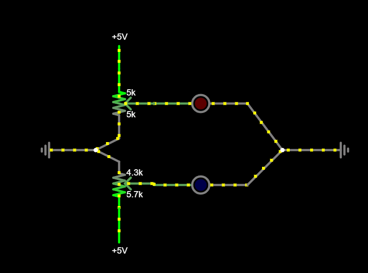
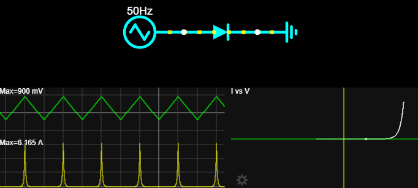
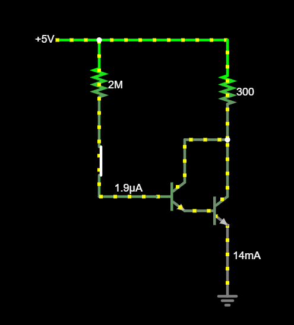

# Iseseisvad ülesanded

## Vilkur
* Millised on joonisel oleva skeemi baaskomponendid?
* Kirjelda nende baaskomponentide ülesandeid.
* Kuidas joonisel kirjeldatud seadeldis töötab? Mida see teeb?

[Lahendus](meedia/lahendus1.md)

## Veider nool
* Millise baaskomponendi millist omadust iseloomustab joonisel kujutatud simulatsioon?

[Lahendus](meedia/lahendus2.md)

## Väike ja suur
* Millised on joonisel oleva skeemi baaskomponendid?
* Kirjelda nende baaskomponentide ülesandeid.
* Millist olulist põhimõtet elektriahelate juhtimisel see joonis illustreerib?

    

[Lahendus](meedia/lahendus3.md)

## Puhas loogika
Koosta Tinkercad Circuitsi või Falstadi keskkonnas ühe käsitletud loogikalülituse toimiv skeem. Väljundit võib kujutada LED-iga: põlev LED tähistab väärtust 1 ja kustunud LED väärtust 0. Kasuta ainult baaselemente.

[AND-värava näidislahendus Tinkercadis](https://www.tinkercad.com/things/1zZjHSwtfRJ-loogiline-ja-and?sharecode=Mlao1zd1NKzDMs5PlaecTwE0GPmVNtz9Z3Nh1RhazGg)

[OR-värava näidislahendus Tinkercadis](https://www.tinkercad.com/things/k5OKHyQM4xn-boolean-or?sharecode=Q_N2grrcD1N0S2RftSjYE-kGVIW4CgOOle91POV1VUA)

[NOT-värava näidislahendus Tinkercadis](https://www.tinkercad.com/things/ehlyUaecuOO-boolean-not?sharecode=QTSbe95ThFf7Hmt9mZNoncRifjTIGwns1WZgC1Smv0A)

[NAND-värava näidislahendus Tinkercadis](https://www.tinkercad.com/things/cKWpkHb8GFN-loogiline-ning-ei-nand?sharecode=qMk2bJtdAiy7M9UP1dYv72W8-Jz7VimcnxSW7D06QEE)

[NOR-värava näidislahendus Tinkercadis](https://www.tinkercad.com/things/6jG6SF4po2D-loogiline-voi-ei-nor?sharecode=Nj8B7htRSWv1ApJxNc0XnDOx5oyHdg8svJ3ExjJUeOM)

## Kruti värve
Ehita Arduino-põhine seade, milles RGB-LED-i värvus määratakse kolme potentsiomeetri abil. Iga potentsiomeeter juhib ühte värvikanalit: punast, rohelist või sinist.

[Kombineeritud LEDi kasutamise näide](https://projecthub.arduino.cc/semsemharaz/interfacing-rgb-led-with-arduino-b59902)

[Näidislahendus Tinkercadis](https://www.tinkercad.com/things/0Oj7ngb50ea-kruti-varve?sharecode=6p5rzaVk1coSySYdHGVry5u3FDqGoANNOPlr7XCLRC0)
