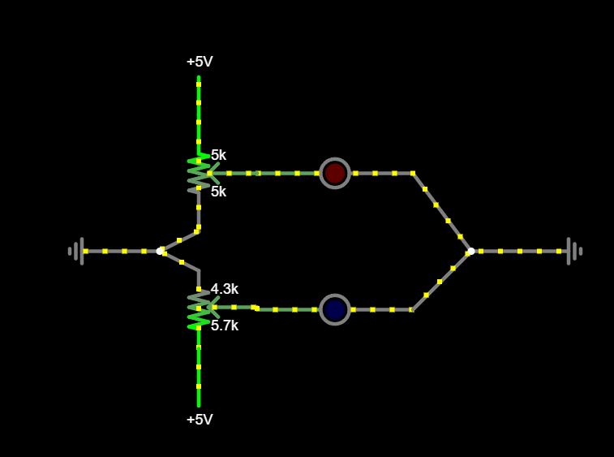
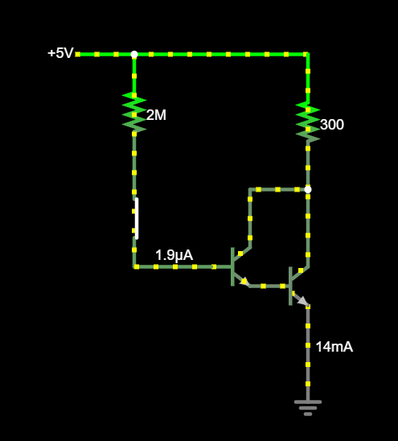

# Iseseisvad ülesanded

## Vilkur
* Millised on joonisel oleva skeemi baaskomponendid?
* Kirjelda nende baaskomponentide ülesandeid?
* Kuidas joonisel kirjeldatud seadeldis töötab? Mida see teeb?

[Lahendus](meedia/lahendus1.md)

## Veider nool
* Millise baaskomponendi millist omadust iseloomustab joonisel kujutatud simulatsioon?

[Lahendus](meedia/lahendus2.md)

## Väike ja suur
* Millised on joonisel oleva skeemi baaskomponendid?
* Kirjelda nende baaskomponentide ülesandeid?
* Millist olulist põhimõtet elektriahelate juhtimisel see joonis illustreerib?

    

[Lahendus](meedia/lahendus3.md)

## Puhas loogika
Koosta Tincecad Circuits või Falstad keskkonnas ühe käsitletud loogikalülituse toimiv skeem (näiteks töötav LED=1 ja mittetöötav LED=0). Kasuta ainult baaselemente.

[AND](https://www.tinkercad.com/things/1zZjHSwtfRJ-loogiline-ja-and?sharecode=Mlao1zd1NKzDMs5PlaecTwE0GPmVNtz9Z3Nh1RhazGg)

[OR](https://www.tinkercad.com/things/lXsmKXBzQyG-loogiline-voi-or?sharecode=0Hr4oAxZRYvMOkC7RVAptxUS-qjsw9fjUwID_YnK1Ek)

[NOT](https://www.tinkercad.com/things/cvQT3VAXxaS-loogiline-ei-not?sharecode=09TnthGebDCkodE65a8g9nQeeGqP-hIMyTD4V4_XhAU)

[NAND](https://www.tinkercad.com/things/cKWpkHb8GFN-loogiline-ning-ei-nand?sharecode=qMk2bJtdAiy7M9UP1dYv72W8-Jz7VimcnxSW7D06QEE)

[NOR](https://www.tinkercad.com/things/6jG6SF4po2D-loogiline-voi-ei-nor?sharecode=Nj8B7htRSWv1ApJxNc0XnDOx5oyHdg8svJ3ExjJUeOM)

## Kruti värve 
Ehita Arduino baasil seade, kus kolme potentsiomeetri abil määratakse kombineeritud LEDi (kolmevärviline) värvus. Iga potentsiomeeter kontrollib ühte värvi.

[Kombineeritud LEDi kasutamise näide](https://projecthub.arduino.cc/semsemharaz/interfacing-rgb-led-with-arduino-b59902)

[Lahendus](https://www.tinkercad.com/things/0Oj7ngb50ea-kruti-varve?sharecode=6p5rzaVk1coSySYdHGVry5u3FDqGoANNOPlr7XCLRC0)
